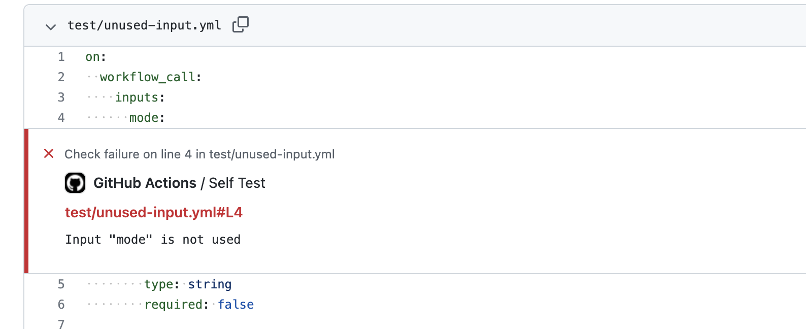

# actions-lint

[](https://github.com/rethab/actions-lint/actions/workflows/ci.yml)


:rocket: GitHub Action to find issues with [reusable actions](https://docs.github.com/en/actions/using-workflows/reusing-workflows) :rocket:

## Use-Case

:thinking: Consider this reusable workflow:

```yaml
on:
  workflow_call:
    inputs:
      mode:
        type: string
        required: true

jobs:
  check:
    runs-on: ubuntu-latest
    steps:
      - run: ./check.sh ${{ inputs.mdoe }}
```

This workflow defines one input `mode` and uses one it to run `check.sh`.
But there's one problem: The author of this workflow typed `mdoe` instead of `mode`.

Normally, this would only be detected when the workflow is triggered, but when using this action, you'll get two errors:

- The input `mode` is not used
- The input `mdoe` is not defined

This makes it easy to identify and fix such problems.

## Features

This action helps identify problems such as:

- unused inputs and secrets
- inputs or secrets that are used but not declared
- inputs that are required but also specify a default value
- actions that are used without specifying a version

## Usage

Check out your repository and specify the files to be linted.

```yaml
on: push

jobs:
  test:
    runs-on: ubuntu-latest
    steps:
      - uses: actions/checkout@v3
      - uses: rethab/actions-lint@v1
        with:
          files: .github/workflows/deploy.yml
```

## Pull Request Integration

If this action is triggered on a pull request, it creates annotations like so:



## Contribution

:heart: Contribution are more than welcome! :heart:

Have you found **something that doesn't work**? Please file an issue with a sample workflow that reproduces the problem.

Can you think of **something new** that could be linted? Please file an issue to start the discussion.

### Community Build

This action includes a community build.
For every change that is made, a number of public workflows are linted to make sure new changes don't break existing workflows.
Do you know about a workflow that should also be included in the community build? Please file an issue or a pull request.
